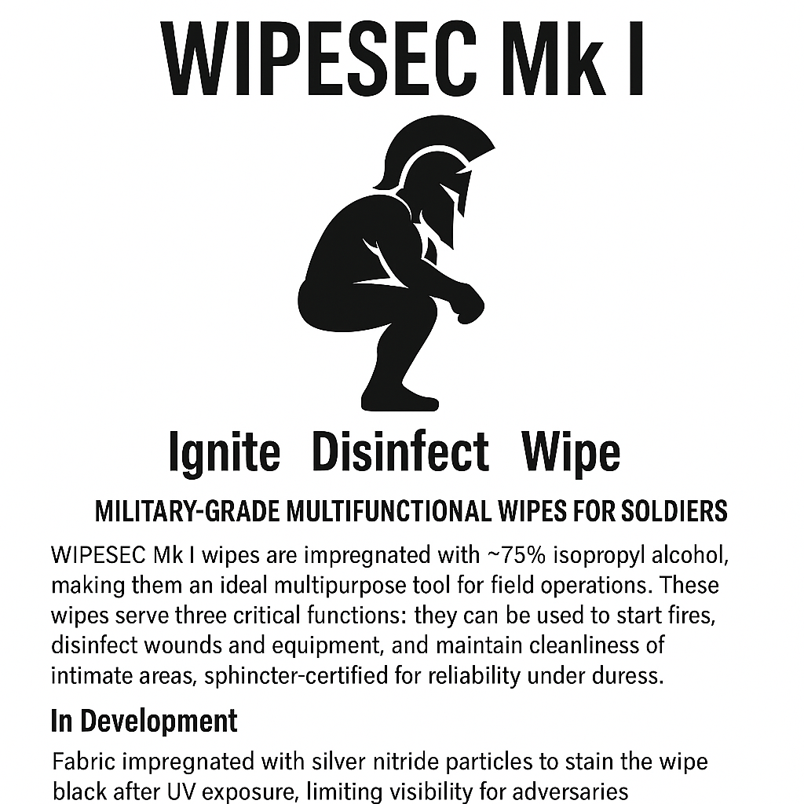

WIPESEC Mk I

Multi-Functional Alcohol-Based Tactical Sanitation Unit (M-ATSU)

CLASSIFIED: For Deployment, Disinfection, and Defiant Defecation

⸻

1. Executive Summary

WIPESEC Mk I is a triple-function tactical consumable engineered for frontline sanitation under hostile and austere conditions. It addresses the critical but overlooked nexus of hygiene, morale, and survival utility in a single, deployable wipe format.

⸻

2. Key Features

Feature	Function
75% Ethanol Content	Effective disinfection of hands, wounds, and post-defecation regions
Firestarter-Ready	Ignites reliably with ferro rod or spark in all weather conditions
Bitterant-Enhanced	Denatonium Benzoate prevents misuse and discourages ingestion
Dual-Ply Performance	Tear-resistant construction; efficient for wiping and tinder generation
Soft Tissue Tolerant	Dermatologically tested, sphincter-certified

⸻

3. Operational Use Cases
	•	SP-75 Sanitation Protocol: Post-defecation hygiene in field environments
	•	TACMED Compatibility: Wound cleansing and microbial decontamination
	•	FIRCOM-1 Fire Protocol: Emergency firestarting and fuel enhancement
	•	SOBRI-CHECK™: Stealth behavioral screening for alcohol-seeking tendencies

⸻

4. Field Endurance Kit: 15-Day Deployment Loadout
	•	3 Packs × 10 Wipes = 30 Wipes
	•	Recommended Use: 2 wipes/day per soldier (1x cleaning, 1x finish/fire)
	•	Total Weight: ~330g
	•	Storage Conditions: -20°C to +55°C
	•	Shelf Life: 24+ months (vacuum sealed)

⸻

5. Safety & Compliance
	•	Conforms to WHO standards for alcohol-based sanitation
	•	Bitterant concentrations: 10–30 ppm (non-toxic, non-irritating)
	•	Marked “NON-POTABLE” for clarity
	•	Complies with draft MIL-HYGIENE-42069 for dual-use field products
	•	Container: Tear-proof, waterproof foil pouches with field-readable labeling

⸻

6. Psychological & Morale Impact

“Every wipe is a moment of dignity. Every fire is a second chance.”
— Anonymous recon soldier, post-chili MRE

Field troops report heightened morale, reduced infection rates, and increased emotional resilience following wipe use. Anecdotal evidence suggests that burning used wipes post-defecation boosts unit cohesion and creates evening ritual opportunities.

⸻

7. NATO & Quartermaster Specifications
	•	Proposed NATO Stock Number (NSN): 6515-99-420-6942
	•	Barcode: █████████████████
	•	Label Designation: WIPESEC Mk I - Tactical Wipe, Ethanol-Based, Ignition-Capable
	•	Logo: Spartan helmet with burning wet wipe background

⸻

8. Conclusion

WIPESEC Mk I represents the future of field sanitation: efficient, compact, morale-boosting, and multi-use. It is not merely a wipe; it is a statement of modern warfighter dignity, hygiene, and preparedness. Deployment recommended for all infantry, special forces, and expeditionary units.

⸻

9. In Development

Advanced Tactical Fabric Variants:
	•	UV-Activated Discoloration: Wipes impregnated with silver nitride particles that darken upon ultraviolet exposure, minimizing visual detection by adversaries in open or sunny environments.
	•	Accelerated Biodegradation: Special fabric composition designed to disintegrate rapidly after alcohol evaporation, reducing traceability and environmental impact.

End of Document.
Authorization: // WipeOps HQ // Level: MIL-ABSURD-1
